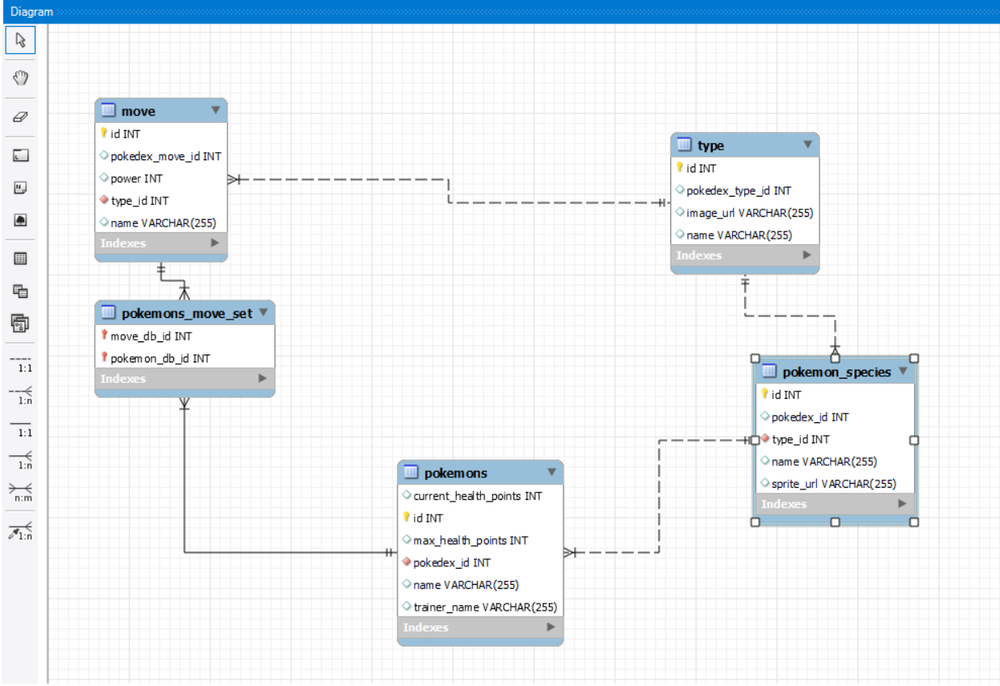
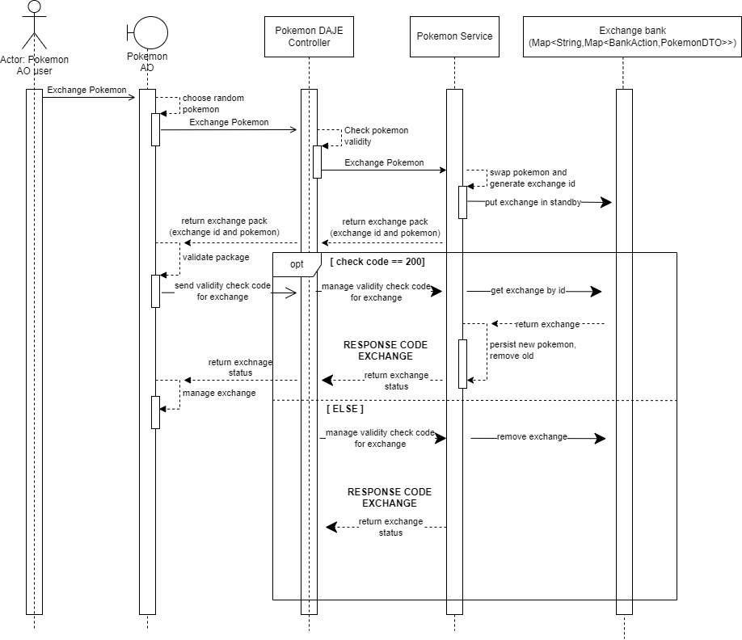

ByTeam-Daje.

# Index:
- [Introduction](#Introduction)
  - Requirements
  - Project description
- [Software Technologies](#Software-Technologies)
  - [Backend](#Backend)
      - Spring Boot Framework and JDK 17
      - Docker
      - Mysql database
      - Swagger
  - [Frontend](#Frontend)
    - Html
    - Css
    - Bootstrap
    - Js
    - Node
- [Encountered issues](#Encountered-issues)
- [Online References](#Online-references)

***

## <a name="Introduction">Introduction</a>

### Requirements:
See all requirements [Here](https://github.com/ErGren/Smarmellearning/blob/main/it/lezione_speciale_pokemon/lezione_speciale_pokemon.md)

### Project description:
Pokemon Daje is a web application that:

- Handles Pokemon exchange requests sent by a client.
- Initially displays six random Pokémon from the stored collection, each with their respective characteristics.
- After the exchange, it will show the received Pokemon along with its information.

`--- immagini di funzionamento (screen)`

***

## <a name="Software-Technologies">Software technologies</a>

- ## <a name="Backend">Backend</a>

### _Spring Boot Framework and JDK 17_:
Spring Boot Framework and JDK 17 have made it possible to develop the project in a simpler and more 
optimized way, using updated libraries while meeting the requirements. Reasons for usage: after thorough 
reviews with the development team, the decision to use JDK 17 was made as it is one of the latest 
versions known and previously tested by the team.

### _Swagger_:
Swagger is an open-source framework used for designing, documenting, and visualizing APIs. 
It provides tools to describe API endpoints, request and response formats, and other related 
information, making it easier for developers to understand and interact with the API.  

see all our Api, click [here](http://localhost:8080/swagger-ui/index.html) 

### _Docker_:
Docker is a platform that enables containerization of applications. 
It allows developers to package an application along with its dependencies, libraries, and configurations 
into a standardized unit called a container. 
These containers are lightweight, portable, and isolated from the underlying
system, making it easy to deploy and run applications consistently across 
different environments, such as development, testing, and production.
  
For all these reasons, we have decided to run the MySQL database in a Docker container

### _Mysql database_:
After carefully reading the requirements and having reasoned together, this type of database was chosen because:
- Open-source relational database (RDBMS),
- fast and lightweight for light workload applications where high performance on simple queries is critical.
- easy to use,
- displaying the structure of the database itself and the data stored in it,
  thus reducing errors and facilitating its construction, via 'workbench'.   

below, the diagram of its structure:

    
 
- ## <a name="FrontEnd">Frontend</a>

### _html_:

### _css_:

### _Bootstrap_:

### _Js_:

### _Node_:

***

- ## <a name="encountered-issues">Encountered issues</a>

### _Initial clone from git_:  
The project cloning, via HTTP, initially caused issues for our team. 
Therefore, we decided to switch to using SSH key since the usage of HTTP is 
outdated/deprecated. By generating individual SSH keys, we were able to 
successfully clone the project from the Git repository.

### _Zscaler Application_: 
Zscaler is a security tool installed on some team members' machines. 
It inspects inbound and outbound network traffic, including SSL, and instantly 
blocks malware, threats, etc.
Once the basic project structure was created using Gradle, the tool prevented the 
download of the necessary libraries to build the project.
Having identified that Zscaler's filters were causing the issue, we decided to switch to Maven.

### _Cors_:
Cross-Origin Resource Sharing is a security setting that checks whether the requesting resource 
is 'safe,' meaning the backend allows access to its resources from the frontend.  

_Our issue_: The backend did not permit access to the frontend.  

_Solution_: We managed CORS permissions on the backend through Spring Security."

### _Pokemon exchange_:
Problems encountered: 
 - normalization on species, type, move;
 - management with double confirmation linked to a single exchange

**Normalization**: Due to the relational mapping and uniqueness of the codes for each element,
pokemon pokedex_id duplicity problems were created.  
This also affected the **management with double confirmation** linked to a single exchange, since 
it requires confirmation from the recipient and the applicant;

**_Solutions_**: the normalization of data in specific methods has been centralized; Instead, for double 
confirmations, a 'division' into levels was carried out:
- _1st level_ = receipt of request, exchange is created by giving an identifier with which to decide 
which pokemon to exchange.
- _2nd level_= confirmation of the answer and analysis of the same with consequent acceptance.

**Solution schema:**

***

## <a name="Online-references">Online references</a>

- ### front-end:
  - [for bootstrap](https://getbootstrap.com/docs/5.3/getting-started/introduction/)
  - [for fetch](https://www.html.it/pag/66525/fetch-api/)
  - Gimp Application - for text color of frontend's words
  - [for html and css functionalities](https://www.w3schools.com/)

- ### backend:
  - Baeldung
  - [for MySql](https://medium.com/@tushar0618/how-to-create-er-diagram-of-a-database-in-mysql-workbench-209fbf63fd03)

- ### for documentation:
  - [for swagger](https://swagger.io/docs/specification/2-0/what-is-swagger/)

